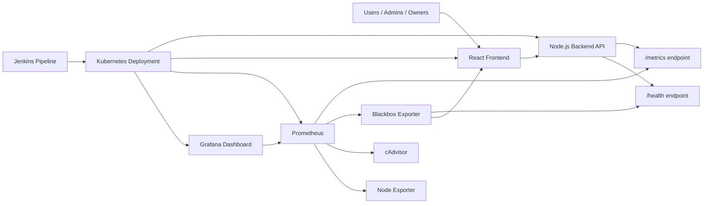

# City Transition System Monitoring Guide

This project no longer uses standalone performance testing with k6 or custom
Node.js scripts. Performance visibility is now handled through continuous
application monitoring with Prometheus and Grafana.

## Monitoring Architecture



Explanation:

- The backend exposes `/metrics` using `prom-client`.
- Prometheus scrapes metrics every 10 to 15 seconds.
- Grafana reads Prometheus data and shows dashboards.
- Blackbox Exporter checks whether frontend and backend URLs are reachable.
- cAdvisor shows container CPU and memory usage.
- Node Exporter shows Kubernetes node CPU, memory, disk, and network usage.
- Jenkins deploys the stack and verifies monitoring health without load tests.
- Jenkins saves a human-readable HTML report at
  `devsecops-reports/devsecops-dashboard.html`.

## Main Metrics Only

The setup focuses on metrics that are easy to explain in a viva:

- API response time and latency:
  `city_transition_http_request_duration_seconds_bucket`
- Request throughput:
  `rate(city_transition_http_requests_total[1m])`
- HTTP request count:
  `city_transition_http_requests_total`
- Error rate:
  `city_transition_http_errors_total`
- Application health:
  `city_transition_up`
- Application uptime:
  `city_transition_process_uptime_seconds`
- Backend CPU:
  `rate(city_transition_process_cpu_seconds_total[5m])`
- Backend memory:
  `city_transition_process_resident_memory_bytes`
- Container CPU and memory:
  `container_cpu_usage_seconds_total`, `container_memory_usage_bytes`
- Uptime probes:
  `probe_success`, `probe_duration_seconds`
- Kubernetes pod health:
  `kubectl get pods`, readiness probes, liveness probes

Important:

- Prometheus scrapes the backend once at `/metrics`.
- The `/metrics` output contains route labels for all endpoints that receive
  traffic, such as `/api/listings`, `/api/accommodation`, `/api/nearby`, and
  `/api/language-helper`.
- Blackbox Exporter separately probes each public demo endpoint so Grafana can
  show endpoint-wise uptime, not only `/health`.

## Prometheus Queries

Backend up:

```promql
city_transition_up
```

Backend uptime:

```promql
city_transition_process_uptime_seconds
```

Request throughput:

```promql
sum(rate(city_transition_http_requests_total[1m]))
```

Request count by route and status:

```promql
sum(city_transition_http_requests_total) by (route, status_code)
```

Average API latency by route:

```promql
sum(rate(city_transition_http_request_duration_seconds_sum[5m])) by (route)
/
sum(rate(city_transition_http_request_duration_seconds_count[5m])) by (route)
```

p95 API response time by route:

```promql
histogram_quantile(
  0.95,
  sum(rate(city_transition_http_request_duration_seconds_bucket[5m])) by (le, route)
)
```

4xx and 5xx error rate:

```promql
100 *
sum(rate(city_transition_http_errors_total[5m]))
/
clamp_min(sum(rate(city_transition_http_requests_total[5m])), 1)
```

Backend CPU:

```promql
rate(city_transition_process_cpu_seconds_total[5m])
```

Backend memory:

```promql
city_transition_process_resident_memory_bytes
```

Container CPU:

```promql
sum(rate(container_cpu_usage_seconds_total{image!=""}[5m])) by (name)
```

Container memory:

```promql
sum(container_memory_usage_bytes{image!=""}) by (name)
```

Node CPU usage:

```promql
100 * (1 - avg(rate(node_cpu_seconds_total{mode="idle"}[5m])))
```

Node memory usage:

```promql
100 * (1 - (node_memory_MemAvailable_bytes / node_memory_MemTotal_bytes))
```

HTTP uptime:

```promql
probe_success{job="blackbox-http"}
```

Endpoint probe latency:

```promql
probe_duration_seconds{job="blackbox-http"}
```

## Grafana Dashboard

Grafana is auto-provisioned with:

- Prometheus datasource
- City Transition System dashboard
- Panels for health, uptime, throughput, response time, latency, error rate,
  backend CPU, backend memory, container CPU, container memory, and uptime probes
- Endpoint-wise Blackbox probe panels for the main public backend APIs

Docker URL:

```text
http://localhost:3001
```

Kubernetes URL:

```text
http://localhost:30300
```

Demo login:

```text
Username: admin
Password: admin
```

## Docker Monitoring Setup

Start the full local stack:

```bash
docker-compose up --build
```

Open:

- Frontend: `http://localhost:3000`
- Backend health: `http://localhost:5000/health`
- Backend metrics: `http://localhost:5000/metrics`
- Prometheus: `http://localhost:9090`
- Prometheus targets: `http://localhost:9090/targets`
- Grafana: `http://localhost:3001`
- cAdvisor: `http://localhost:8080`

Docker monitoring files:

- `docker-compose.yml`
- `monitoring/prometheus/prometheus-docker.yml`
- `monitoring/blackbox/blackbox.yml`
- `monitoring/grafana/provisioning/datasources/prometheus.yml`
- `monitoring/grafana/provisioning/dashboards/dashboards.yml`
- `monitoring/grafana/dashboards/city-transition-dashboard.json`

## Kubernetes Monitoring Setup

Apply all manifests:

```bash
kubectl apply -f k8s/
```

Check rollout:

```bash
kubectl rollout status deployment/backend
kubectl rollout status deployment/frontend
kubectl rollout status deployment/prometheus
kubectl rollout status deployment/blackbox-exporter
kubectl rollout status deployment/grafana
```

Check pod health:

```bash
kubectl get pods -o wide
kubectl get deployments
kubectl get daemonsets
kubectl get services
```

Open:

- Frontend: `http://localhost:30007`
- Backend API: `http://localhost:30008`
- Backend health: `http://localhost:30008/health`
- Backend metrics: `http://localhost:30008/metrics`
- Prometheus: `http://localhost:30090`
- Prometheus targets: `http://localhost:30090/targets`
- Grafana: `http://localhost:30300`

Kubernetes monitoring files:

- `k8s/prometheus-configmap.yaml`
- `k8s/prometheus-deployment.yaml`
- `k8s/prometheus-service.yaml`
- `k8s/grafana-secret.yaml`
- `k8s/grafana-configmaps.yaml`
- `k8s/grafana-deployment.yaml`
- `k8s/grafana-service.yaml`
- `k8s/blackbox-configmap.yaml`
- `k8s/blackbox-deployment.yaml`
- `k8s/blackbox-service.yaml`
- `k8s/node-exporter.yaml`
- `k8s/cadvisor.yaml`

## Jenkins Pipeline Integration

The Jenkinsfile now uses this flow:

```text
Checkout
Install dependencies
ESLint
Unit and integration tests
Coverage
SonarQube
npm audit
Docker build
Docker push
Kubernetes deployment with Ansible or kubectl fallback
Deployment verification
Postman/Newman smoke tests
Prometheus and Grafana monitoring check
Pipeline summary
```

Removed from Jenkins:

- `tools/performance-test.js`
- k6 performance test stage
- npm performance scripts
- CI failure caused by strict standalone performance validation

Jenkins monitoring artifacts:

- `devsecops-reports/kubernetes-verification-report.txt`
- `devsecops-reports/backend-health-report.json`
- `devsecops-reports/prometheus-metrics-sample.txt`
- `devsecops-reports/prometheus-metrics-snapshot.txt`
- `devsecops-reports/monitoring-health-report.txt`
- `devsecops-reports/endpoint-evidence.html`
- `devsecops-reports/endpoint-evidence.json`
- `devsecops-reports/prometheus-query-evidence.json`
- `devsecops-reports/devsecops-dashboard.html`
- `devsecops-reports/devsecops-summary.md`

## Visual Report

Jenkins generates a browser-friendly report:

```text
devsecops-reports/devsecops-dashboard.html
```

Open it from Jenkins build artifacts. It shows:

- DevSecOps concept status cards
- Static analysis evidence
- Test and coverage evidence
- Security scan evidence
- Docker image evidence
- Kubernetes deployment evidence
- Endpoint-wise API evidence
- Prometheus query evidence
- Links to saved raw artifacts

Endpoint evidence is also saved separately:

```text
devsecops-reports/endpoint-evidence.html
devsecops-reports/endpoint-evidence.json
devsecops-reports/endpoint-responses/
```

## Viva-Ready Explanations

Continuous monitoring:

Continuous monitoring means the system is observed all the time after
deployment. Instead of running one temporary performance script, Prometheus
keeps collecting metrics every few seconds and Grafana keeps showing the latest
health and performance data.

Observability:

Observability means we can understand what is happening inside the application
from outside signals. In this project, metrics such as request count, latency,
error rate, CPU, memory, and uptime help explain whether the system is healthy.

Application Performance Monitoring:

Application Performance Monitoring focuses on backend API behavior. The
`/metrics` endpoint records how many API calls happen, how long they take, and
how many fail with 4xx or 5xx status codes.

Infrastructure monitoring:

Infrastructure monitoring checks the Kubernetes nodes. Node Exporter provides
CPU, memory, disk, filesystem, and network metrics for the host machines.

Container monitoring:

Container monitoring checks resource usage inside running containers. cAdvisor
shows CPU and memory usage for backend, frontend, Prometheus, Grafana, and other
containers.

Grafana visualization:

Grafana converts Prometheus queries into graphs and stat panels. In the demo,
the dashboard shows response time, latency, throughput, CPU usage, memory usage,
error rate, uptime, and container resource usage in real time.

## Demo Script

1. Run Jenkins pipeline.
2. Show the successful pipeline summary.
3. Open backend health: `http://localhost:30008/health`.
4. Open backend metrics: `http://localhost:30008/metrics`.
5. Open Prometheus targets: `http://localhost:30090/targets`.
6. Open Grafana: `http://localhost:30300`.
7. Refresh the frontend and call a few APIs.
8. Show Grafana panels updating for throughput, latency, and request count.
9. Explain that no standalone load/performance script is required.
10. Show Jenkins archived `monitoring-health-report.txt`.
